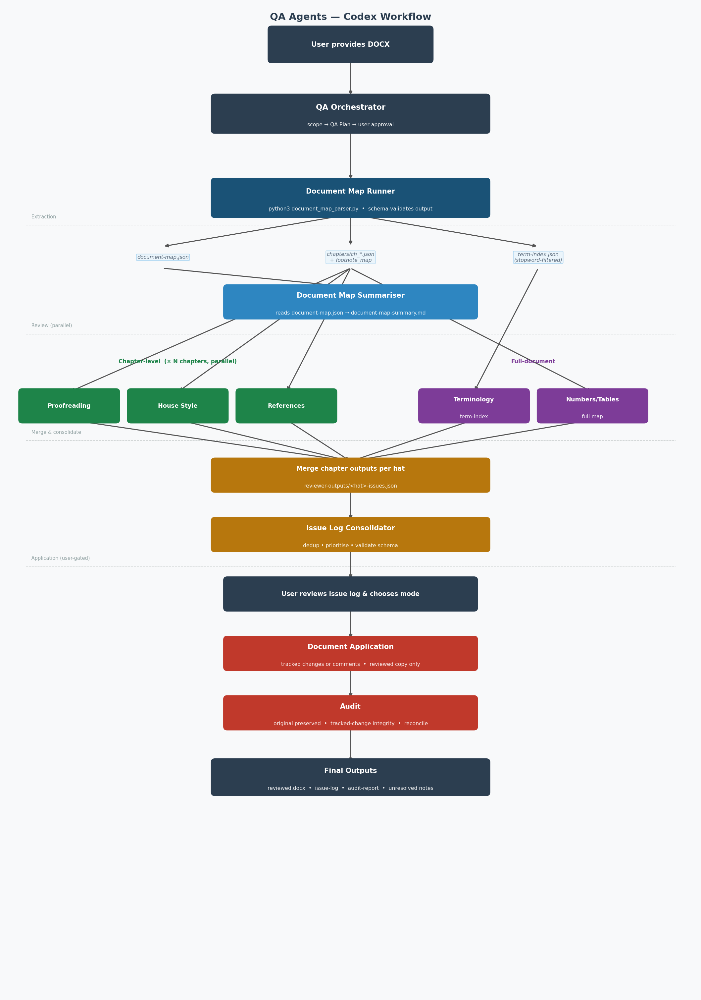

# Codex Word QA Workflow

This repository defines an agent-first Codex workflow for AI-supported QA of Word documents.

The core review and application process is orchestrated by Codex agents. `document_map_parser.py` is a deterministic Python helper used only for DOCX extraction — it is not the review engine.

## Workflow Overview

## Workflow

1. User provides a Word document.
2. Orchestrator scopes QA using the minimum required questions.
3. Orchestrator checks for previous-run artifacts and lists the exact cleanup set before any deletion:
   - `qa_run/working/document-map.json`
   - `qa_run/working/document-map-summary.md`
   - `qa_run/working/qa-plan.json`
   - `qa_run/working/application-plan.json`
   - `qa_run/working/issue-log.md`
   - `qa_run/working/issue-log.csv`
   - `qa_run/working/application_log.json`
   - `qa_run/working/audit-report.json`
   - `qa_run/working/audit-report.md`
   - `qa_run/working/unresolved_issues.md`
   - `qa_run/working/*.reviewed.docx`
   - `qa_run/working/reviewer-packs/` (any files)
   - `qa_run/working/reviewer-outputs/` (any files)
   - `qa_run/working/chapters/` (any files)
   - `qa_run/working/term-index.json`
   - `qa_run/outputs/` (any files)
   - any `qa_run/working/docx_package_*` directories
4. Orchestrator creates a QA Plan including chapter count and estimated subagent count.
5. User approves or edits the QA Plan before any mapping or reviewer work begins.
6. Document extraction runs in two steps:
   - **Document Map Runner** runs `document_map_parser.py` and writes three outputs: `document-map.json` (full structure), `chapters/` (one JSON per section), and `term-index.json` (recurring-term index). Validates `document-map.json` against the schema before proceeding. Fails loudly on any error.
   - **Document Map** reads `document-map.json` and writes a human-readable `document-map-summary.md`.
7. Selected reviewer subagents run. Hats split by scope:
   - **Chapter-level** (one subagent per chapter, run in parallel): footnote proofreader update, style proofreader.
   - **Full-document** (one subagent for the whole document): technical proofreader, terminology (uses term-index, not raw paragraphs), numbers/tables/claims.
   - Legacy fallback reviewers (`proofreading_reviewer`, `house_style_reviewer`, `references_sources_reviewer`) are excluded by default because the newer reviewers are stronger.
8. Issue Log Consolidator reads merged outputs from `qa_run/working/reviewer-outputs/`, deduplicates and consolidates all findings.
9. User chooses application mode: issue-log-only, comments-only, tracked changes for safe edits and comments for everything else, rerun selected hat, or stop without applying changes.
10. Document Application subagent applies only user-approved changes to the reviewed copy.
11. Audit subagent runs after any document application.
12. Outputs are reviewed `.docx` where applicable, issue log, application log where applicable, audit report where applicable, and optional unresolved issues note.

## Subagents

| Subagent | Scope | Role |
|---|---|---|
| `document_map_runner` | — | Runs `document_map_parser.py`; writes `document-map.json`, `chapters/`, `term-index.json`. No LLM parsing. |
| `document_map` | — | Reads `document-map.json`; writes human summary. Read-only. |
| `footnote_proofreader_update` | Chapter-level | Footnotes, endnotes, citation markers, marker punctuation, source-name consistency. |
| `style_proofreader` | Chapter-level | Frontier writing principles, structure, tone, readability, concision. |
| `technical_proofreader` | Full document | Grammar, punctuation, capitalization, numbers, acronyms, cross-references, and mechanical correctness. |
| `terminology_reviewer` | Full document | Defined terms, acronyms, party names, terminology consistency (uses term-index). |
| `numbers_tables_claims_reviewer` | Full document | Internal consistency of numbers, percentages, units, tables, quantified claims. |
| `issue_log_consolidator` | — | Validates, deduplicates, prioritises, and formats reviewer outputs. |
| `document_application` | — | Applies only user-approved changes to the reviewed copy. |
| `audit` | — | Checks original preservation, tracked-change integrity, silent XML changes, reject-all feasibility. |

Legacy fallback reviewers are still available for explicit comparison or migration runs:

| Subagent | Scope | Role |
|---|---|---|
| `proofreading_reviewer` | Legacy fallback | Mechanical grammar/spelling pass; excluded by default. |
| `house_style_reviewer` | Legacy fallback | Legacy house-style pass; excluded by default. |
| `references_sources_reviewer` | Legacy fallback | Legacy references/footnote pass; excluded by default. |

Subagent TOMLs live in `codex/subagents/`.

## Token Efficiency

The pipeline is designed to minimise token consumption:

- Chapter-level hats receive only their chapter's paragraphs — not the full document.
- Each chapter file includes a `footnote_map` so reviewers can resolve `[fn:X]` markers inline without accessing the full document map.
- Terminology hat receives a pre-computed term-occurrence index, not raw paragraph text. Common stopwords are filtered from the index.
- Numbers hat receives only `numeric_claims` and `tables` arrays — no prose.
- `surrounding_sentence` fields are capped at 120 characters.
- Bare list markers (1., 2) etc.) are filtered from numeric claims before packing.
- `document-map.json` is schema-validated immediately after extraction; a bad parse stops the workflow before any reviewer runs.

## Safety Model

- The original Word document is never modified.
- All document modification happens only on a reviewed copy.
- Reviewer subagents do not edit files.
- Reviewer subagents return structured JSON issues only.
- No silent text changes are allowed.
- Tracked changes are used only if they can be produced robustly.
- If robust tracked changes cannot be guaranteed, the workflow stops or falls back to comments-only only after telling the user.
- The default modification mode is tracked changes for safe edits and comments for everything else.
- Judgement-heavy issues are not automatically rewritten.
- The Audit subagent must run after any document application step.

## How To Use In Codex

1. Start with the QA Orchestrator.
2. Provide the Word document path.
3. Answer the minimum scoping questions. The Orchestrator will show which hats are chapter-level vs full-document.
4. Review and approve the QA Plan (includes chapter count and estimated subagent count).
5. The Orchestrator runs the Document Map Runner, then the Document Map summariser.
6. Chapter-level reviewer subagents run in parallel per chapter. Full-document reviewers run once.
7. Inspect the consolidated issue log.
8. Choose the application mode from the friendly Application Plan Summary:
   - issue log only
   - comments only
   - tracked changes for safe edits and comments for everything else
   - choose issue by issue
   - rerun selected hat (chapter-level: choose all chapters or a specific one)
   - stop without applying changes
9. If applying changes, approve the friendly application summary. The raw `application-plan.json` remains the machine-readable contract, but the user-facing view shows counts, safety rules, output path, and the available options.
10. Inspect the reviewed `.docx`, issue log, application log, unresolved issues note if created, and audit report.

## Repository Layout

- `AGENTS.md` — operating rules for this repository.
- `document_map_parser.py` — deterministic DOCX extraction helper. CLI flags: `--output`, `--by-chapter`, `--term-index`.
- `codex/subagents/` — Codex subagent TOML definitions.
- `codex/workflows/` — workflow guidance for scoping and reruns.
- `schemas/` — JSON schemas for QA plans, document maps, issues, issue logs, application plans, and audit reports.
- `examples/` — matching example JSON files.
- `qa_run/input/` — place input DOCX here before starting.
- `qa_run/working/` — all working files: `document-map.json`, `chapters/`, `term-index.json`, `reviewer-packs/` (input packs for reviewers), `reviewer-outputs/` (merged per-hat JSON before consolidation).
- `qa_run/outputs/` — final outputs.
- `prompts/`, `docs/`, `tests/` — reserved for future workflow material and validation fixtures.

## Known Limitations

- Tracked changes may depend on the available Codex and Word document environment capabilities.
- Reject-all simulation may not always be technically available.
- The Numbers, Tables and Quantified Claims reviewer checks internal consistency, not truth.
- The House Style reviewer is only fully calibrated when a style guide or examples are supplied.
- Source and citation review depends on the supplied document map, source list, and context files.
- The term index captures recurring capitalised phrases and acronyms; it does not perform full NLP term extraction.
